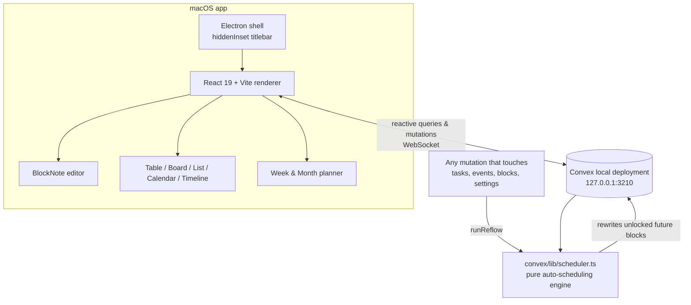

# Geekspace

**Your workspace, As The Geek Learns it** — a Notion-style macOS desktop app with pages, databases, and a calendar that schedules itself.

Built with the ASTGL brand: Inter, burnt orange (`#E9724C`) on warm gray in light mode, vivid orange (`#FF6B35`) on deep navy (`#1A1A2E` / `#16213E`) in dark mode.

 

---

## What it does

### 📝 Pages & block editor
- Notion-style block editor (BlockNote/ProseMirror): type `/` for the block menu — headings, lists, to-dos, toggles, quotes, code, tables, images
- Markdown shortcuts (`#`, `-`, `[]`, `>`), drag handles, nesting
- Image uploads stored in Convex file storage
- Infinite page nesting in the sidebar, emoji icons, favorites, trash with restore

### 🗄️ Databases (Notion Projects-style PM)
- Property types: title, text, number (incl. minutes/progress formats), select, multi-select, **status with To-do / In Progress / Complete groups**, date (optional time + end date), checkbox, URL, **relation (two-way synced, incl. same-database pairs)**, **rollup** (count/sum/avg/min/max/**% complete**), created/updated time
- Views per database: **Table** (inline editing), **Board** (drag cards between status columns), **List**, **Calendar** (drag items between days), **Timeline** (drag/resize Gantt bars **with dependency arrows**)
- Per-view filters (and/or rules, incl. filter-by-relation), sorts, hidden properties
- Every row opens as a full page with its own block content
- **Sub-tasks** (Parent task ⇄ Sub-tasks) and **dependencies** (Blocked by ⇄ Blocking) — and unlike Notion, dependencies aren't just visual: the auto-scheduler won't place blocked work before its blockers finish
- **Sprints**: two-week iterations with progress rollups, a current-sprint board, a backlog view, and a **Complete sprint** automation that closes the sprint, spins up the next one, and rolls unfinished tasks forward
- Seeded template: `Projects ⇄ Tasks ⇄ Sprints` wired with relations + `Progress` rollups

### 📅 The calendar that schedules itself
The headline feature, modeled on Notion Calendar + Motion/Reclaim:

- Fixed **events** (appointments) are immovable; any database can be a **task source** (status + due date + estimate + priority)
- The engine packs task **time blocks** into your working hours around fixed events:
  - earliest-deadline-first, then priority (Urgent → Low), then size
  - chunking between your min/max block sizes, buffer minutes between items
  - **everything reflows automatically** when an event moves, a task changes, a block is dragged, or settings change
- Drag a block → it **locks** (engine schedules around it); unlock to hand it back
- Started/past blocks are **frozen history**; remaining work is recomputed from what's left
- Can't-fit and past-due tasks surface in the **needs attention** panel — nothing silently drops
- Week grid: drag to create events, drag to move, resize from the bottom edge, 15-min snapping, now-line; month overview with ⚡ block counts
- Keyboard: `T` today · `J`/`K` next/prev · `W`/`M` views

### 🤖 ARCHITECT — your workspace agent (embedded, local)
- Chat with ARCHITECT in-app (Agent in the sidebar): it designs, creates, and configures pages/databases/projects/tasks for you, and changes appear live
- **Two lanes, one toolset** (toggle in the panel header):
  - **Local (default)** — a local Ollama model (prefers `qwen3-coder`; override with `GEEKSPACE_LOCAL_MODEL` in `.env.local`) drives the same workspace tools for free. Right for routine asks: what's overdue, add a task, create a page.
  - **Claude** — the Claude Agent SDK lane for complex design work (multi-database structures, reorganizations). From 2026-06-15, SDK calls bill a separate per-user credit pool at API rates, so spend it where frontier judgment matters.
- The Claude lane runs **entirely on this Mac** via the Agent SDK in the Electron main process, using your Claude Code sign-in (`~/.claude/.credentials.json`) — **no API key, no external service**
- Powered by **`geekspace-mcp`** (`mcp/index.mjs`): a standard MCP server exposing the workspace (name-keyed properties, option validation, schedule awareness, template instantiation). Because it's a standard server, **any** MCP client can drive your workspace too — `claude mcp add geekspace --env CONVEX_URL=http://127.0.0.1:3210 -- node mcp/index.mjs`
- Create/edit only — no delete tools by design

### 🔎 Enterprise Search (ASTGL)
- Knowledge page + ⌘K section searching your local `mcp-astgl-knowledge` server — semantic results with scores + an explicit sourced-Answer mode; pluggable connector design for future sources

### 🗂 Project Templates
- Stamp out projects with offset due dates + pre-wired dependency chains; tasks auto-schedule the moment they're created
- 3 built-ins (ASTGL Article, Podcast Episode, Home-Lab Project) + save your own from any project

### 📁 Docs library
- Drag-drop file library with in-app previews (PDF/images/AV/markdown/code), project linking, ⌘K search, and default-app handoff for everything else

### 🎙️ AI Meeting Notes — 100% local
- One-click meeting recording with a floating recorder (pause/resume, live level meter)
- **whisper.cpp** transcription + **local Ollama** summarization — audio never leaves the Mac
- Summaries tailored by meeting type (standup / 1:1 / client / interview / brainstorm): narrative summary, key points, decisions, and action items
- Auto-generated, searchable notes page per meeting; action items become tasks in one click; audio replay + full transcript kept; failed AI runs are re-runnable (audio is saved first)
- Link recordings to calendar events; tool status + model selection in Settings

### 🍎 macOS integrations (desktop app)
- **Calendar sync**: pick your Calendar.app calendars and they mirror into Geekspace (read-only, dotted edge) — and become fixed busy time the auto-scheduler plans around. Syncs at launch, on focus, and every 5 minutes
- **Mail inbox on Home**: recent Mail.app messages with unread dots, open-in-Mail deep links, and one-click **email → task** (the task links back to the message)
- One-time macOS Automation permission per app on first use

### 🏠 Home + ⌘K
- Home: today's agenda, My Tasks (Overdue / Today / Upcoming) with one-click done + ⛓ blocked chips, Mail inbox, schedule warnings, recent pages
- `⌘K` command palette: full-text search across pages and rows + quick actions (`⌘N` new page, `⌘1` home, `⌘2` calendar)

📖 **Full walkthrough: [docs/USER-GUIDE.md](docs/USER-GUIDE.md)** (a condensed copy lives in the app sidebar).

---

## Architecture



**Key decisions**

| Decision | Why |
|---|---|
| Convex **anonymous local** deployment | No account, no auth, data stays on this Mac, still fully reactive (dev: repo `.convex/`; packaged: `~/Library/Application Support/Geekspace/`) |
| Electron owns the backend lifecycle (packaged) | The app spawns the bundled `convex-local-backend` on launch and stops it on quit — self-contained, no terminal |
| Pure scheduler module shared by server + tests | Deterministic, 16 unit tests, no UI coupling |
| Reflow inside every relevant mutation | The cascade can never be forgotten; UI updates reactively for free |
| Drag = lock | Matches Motion/Reclaim mental model: a manual placement is a promise the engine must respect |
| Date-only values stored as UTC-midnight calendar dates | Timezone-proof dates (like Notion); timed values are real epochs |
| Fixed tz-offset scheduling with constant reflow | Near-term blocks always correct; DST drift self-heals on every reflow |

## Running it

### Develop

```bash
npm install
npm run dev        # Convex backend + Vite + Electron, all at once
```

First run only:

```bash
npm run seed       # Projects/Tasks template + sample week (idempotent)
```

### Build the standalone app

```bash
npm run package             # → self-contained Geekspace.app + .dmg in release/
npm run migrate:local-data  # one-time: copy your dev workspace into the app
```

`npm run package` bundles the Convex backend binary **and** a pre-baked seed
(functions already deployed + starter template) into the app. The built
**`Geekspace.app` starts its own backend on launch — no terminal, no repo, no
`npx convex dev`.** Data lives in `~/Library/Application Support/Geekspace/`.

First open of the unsigned build: right-click → Open. After you change backend
functions and repackage, run `npm run deploy:local` (with the app open) to push
them onto your existing data — an app update never overwrites your workspace.

Other scripts:

| Script | What |
|---|---|
| `npm run dev:web` | backend + browser dev (no Electron) |
| `npm run test` | scheduler engine test suite (vitest) |
| `npm run verify` | typecheck + tests |
| `npm run package` | build self-contained `Geekspace.app` + `.dmg` into `release/` |
| `npm run migrate:local-data` | copy your dev `.convex` workspace into the packaged app |
| `npm run deploy:local` | push function changes onto the running standalone app |

> In **dev**, `npm run dev` runs the backend (data in the repo's `.convex/`). The
> packaged app is self-contained: Electron starts the bundled backend itself and
> keeps data in `~/Library/Application Support/Geekspace/`.

## Project layout

```
convex/             # backend: schema, functions, the scheduling engine
  lib/scheduler.ts  #   pure engine — buildDayWindows / computeSchedule
  scheduling.ts     #   runReflow — gathers tasks+busy, rewrites blocks
  seed.ts           #   PM template + sample data
src/
  components/       # sidebar, page editor, database views, calendar, home
  lib/              # view filter/sort logic, dates, theme palette
  state/            # zustand UI state, theme provider
electron/           # main.mjs, preload.cjs, convexBackend.mjs (backend lifecycle) — no build step
scripts/            # prebake-seed, migrate-local-data, deploy-local, afterPack
tests/              # scheduler test suite
```

## Known limits (v1.1)

- Single user, no auth, no cloud sync — by design
- Packaged app is signed with a Developer ID but not notarized (personal use; right-click → Open the first time)
- macOS Calendar sync is one-way (Calendar → Geekspace) and needs Calendar.app running; Mail widget needs Mail.app running
- Far-future blocks across a DST switch can sit an hour off until any reflow corrects them
- Deleting a row leaves dangling relation ids on the other side; cells skip them gracefully

## License

MIT — see [LICENSE](LICENSE). A personal learning project, shared as-is; no support or warranty implied.

---

*An As The Geek Learns build — 2026.*
