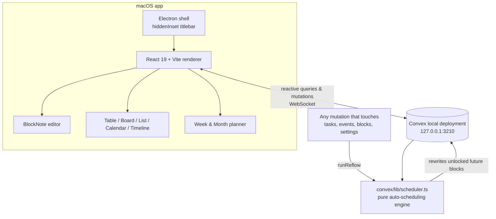

# Geekspace

**Your workspace, As The Geek Learns it** — a Notion-style macOS desktop app with pages, databases, and a calendar that schedules itself.

Built with the ASTGL brand: Inter, burnt orange (`#E9724C`) on warm gray in light mode, vivid orange (`#FF6B35`) on deep navy (`#1A1A2E` / `#16213E`) in dark mode.

 

---

## What it does

### 📝 Pages & block editor
- Notion-style block editor (BlockNote/ProseMirror): type `/` for the block menu — headings, lists, to-dos, toggles, quotes, code, tables, images
- Markdown shortcuts (`#`, `-`, `[]`, `>`), drag handles, nesting
- Image uploads stored in Convex file storage
- Infinite page nesting in the sidebar, emoji icons, favorites, trash with restore

### 🗄️ Databases (Notion Projects-style PM)
- Property types: title, text, number (incl. minutes/progress formats), select, multi-select, **status with To-do / In Progress / Complete groups**, date (optional time + end date), checkbox, URL, **relation (two-way synced)**, **rollup** (count/sum/avg/min/max/**% complete**), created/updated time
- Views per database: **Table** (inline editing), **Board** (drag cards between status columns), **List**, **Calendar** (drag items between days), **Timeline** (drag/resize Gantt bars)
- Per-view filters (and/or rules), sorts, hidden properties
- Every row opens as a full page with its own block content
- Seeded template: `Projects ⇄ Tasks` wired with a relation + a `Progress` rollup showing % of tasks complete per project

### 📅 The calendar that schedules itself
The headline feature, modeled on Notion Calendar + Motion/Reclaim:

- Fixed **events** (appointments) are immovable; any database can be a **task source** (status + due date + estimate + priority)
- The engine packs task **time blocks** into your working hours around fixed events:
  - earliest-deadline-first, then priority (Urgent → Low), then size
  - chunking between your min/max block sizes, buffer minutes between items
  - **everything reflows automatically** when an event moves, a task changes, a block is dragged, or settings change
- Drag a block → it **locks** (engine schedules around it); unlock to hand it back
- Started/past blocks are **frozen history**; remaining work is recomputed from what's left
- Can't-fit and past-due tasks surface in the **needs attention** panel — nothing silently drops
- Week grid: drag to create events, drag to move, resize from the bottom edge, 15-min snapping, now-line; month overview with ⚡ block counts
- Keyboard: `T` today · `J`/`K` next/prev · `W`/`M` views

### 🏠 Home + ⌘K
- Home: today's agenda, My Tasks (Overdue / Today / Upcoming) with one-click done, schedule warnings, recent pages
- `⌘K` command palette: full-text search across pages and rows + quick actions (`⌘N` new page, `⌘1` home, `⌘2` calendar)

---

## Architecture



**Key decisions**

| Decision | Why |
|---|---|
| Convex **anonymous local** deployment | No account, no auth, data stays on this Mac (`~/.convex`), still fully reactive |
| Pure scheduler module shared by server + tests | Deterministic, 16 unit tests, no UI coupling |
| Reflow inside every relevant mutation | The cascade can never be forgotten; UI updates reactively for free |
| Drag = lock | Matches Motion/Reclaim mental model: a manual placement is a promise the engine must respect |
| Date-only values stored as UTC-midnight calendar dates | Timezone-proof dates (like Notion); timed values are real epochs |
| Fixed tz-offset scheduling with constant reflow | Near-term blocks always correct; DST drift self-heals on every reflow |

## Running it

```bash
npm install
npm run dev        # Convex backend + Vite + Electron, all at once
```

First run only:

```bash
npm run seed       # Projects/Tasks template + sample week (idempotent)
```

Other scripts:

| Script | What |
|---|---|
| `npm run dev:web` | backend + browser dev (no Electron) |
| `npm run test` | scheduler engine test suite (vitest) |
| `npm run verify` | typecheck + tests |
| `npm run package` | build `Geekspace.app` + `.dmg` into `release/` |

> **The local Convex backend must be running** for the app to have data — `npm run dev` handles it. The packaged `.app` expects `npx convex dev` (or the dev script) running in the repo. Data persists in `~/.convex` across restarts.

## Project layout

```
convex/             # backend: schema, functions, the scheduling engine
  lib/scheduler.ts  #   pure engine — buildDayWindows / computeSchedule
  scheduling.ts     #   runReflow — gathers tasks+busy, rewrites blocks
  seed.ts           #   PM template + sample data
src/
  components/       # sidebar, page editor, database views, calendar, home
  lib/              # view filter/sort logic, dates, theme palette
  state/            # zustand UI state, theme provider
electron/           # main.mjs + preload.cjs (no build step)
tests/              # scheduler test suite
```

## Known limits (v1)

- Single user, no auth, no sync — by design
- Packaged app is unsigned (personal use; right-click → Open the first time)
- Far-future blocks across a DST switch can sit an hour off until any reflow corrects them
- Deleting a row leaves dangling relation ids on the other side; cells skip them gracefully

---

*An As The Geek Learns build — 2026.*
